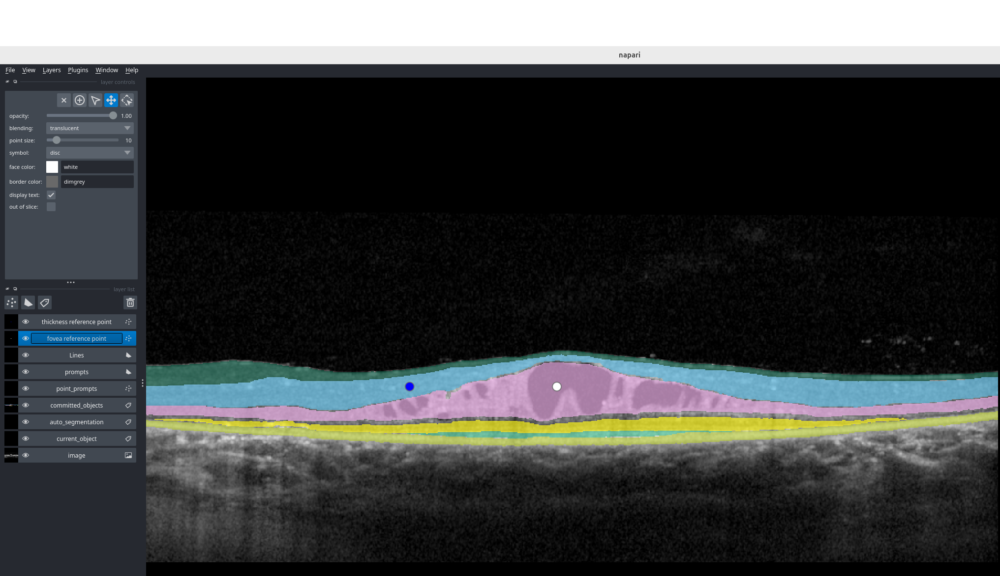
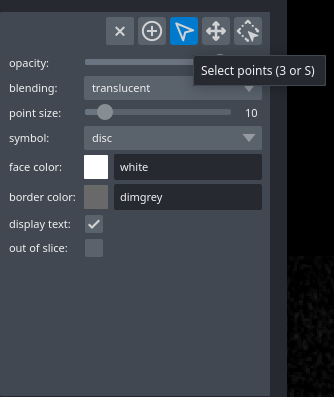
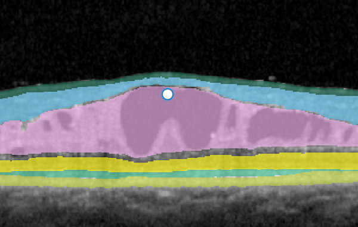
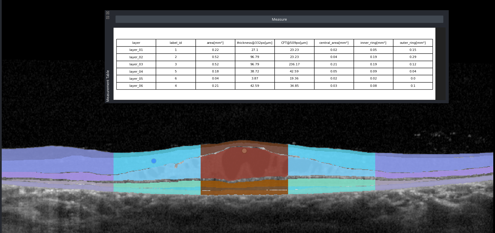
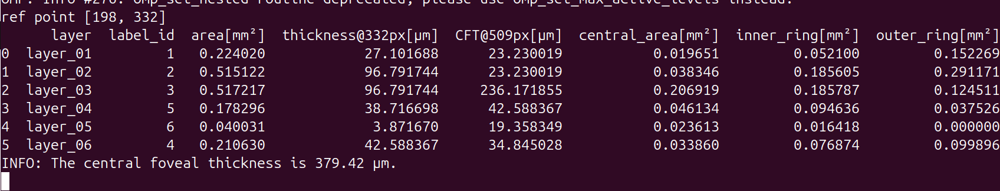
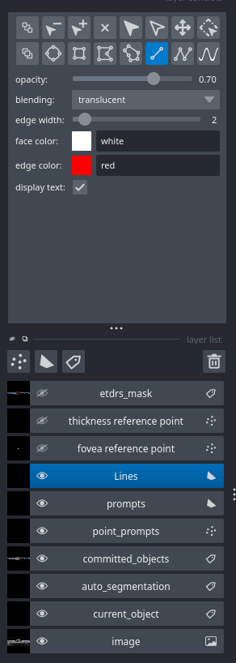
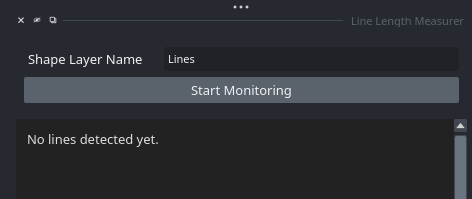
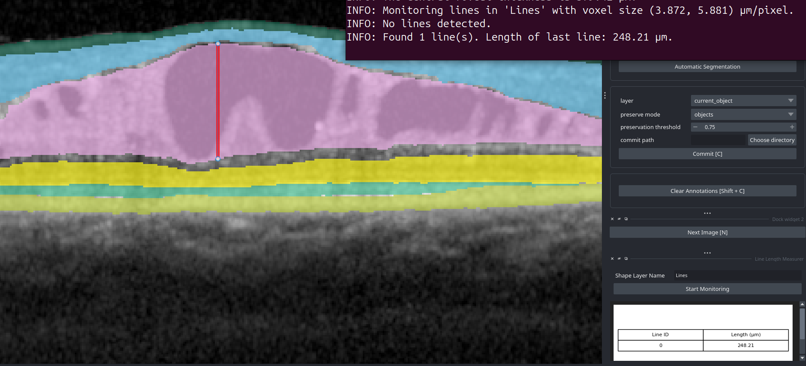

# Analysing retinal layers using interactive segmentation or a retrospective measurement

Different napari widgets allow the analysis of retinal layers by determining their thickness at specific reference points and ETDRS-like areas.
This can either be performed in an interactive segmentation using OCT-SAM or retrospectively on a segmentation.

## Requirement: Install `oct_tools` in your environment
Follow the installation instructions in the `README.md` to install functionalities for the command line interface (CLI).

## Analyse the segmentation using the interactive segmentation

### Download the OCT-SAM model

Download the OCT-SAM model `oct-sam-V1.pt` from ownCloud:
[Download from ownCloud](https://owncloud.gwdg.de/index.php/s/12FhJAc8XTNzHLA)

### Interactively segment the image and measure retinal layers

To apply an OCT-SAM model and measure the thicknesses of retinal layers at the same time, use the `oct_tools.interactive` function:
```bash
oct_tools.interactive --model /path/to/oct-sam-model.pt --precompute_segmentation --output /path/to/output_folder/ --input /path/to/input_image.h5
```

## Run a retrospective measurement
It is also possible to measure retinal layers after the segmentation is completed by using the `oct_tools.measure` function:
```bash
oct_tools.measure -i /path/to/input_image.tif -s /path/to/input_segmentation.tif -o /path/to/output_folder/
```

# Measure the central foveal thickness and ETDRS-like areas

Napari uses different layers, which can be individually activated and manipulated by clicking on the respective layer.
A list of all available layers titled **layer list** can be found on the left side of the napari GUI.

1) Go to the `fovea reference point` layer on the left side of the GUI and activate it.



2) Go to the **layer controls** section and activate `Select points`.



3) Move the white dot to the foveal point or remove it if the foveal point is not present in the slice.



4) Click the `Measure` button on the right side of the interface in the **Measurement Table** widget to create a measurement table which features the central foveal thickness (CFT).



5) The measurement table and the CFT are also displayed in the terminal.



The measurement table can be saved using the `Save Measurements` button at the bottom of the interface.
The point in the `thickness reference point` layer can be repositioned in the same way as the foveal reference point.

# Manually measure thicknesses

Distances in the scan can also be measured using manually drawn lines.

1) Select the `Lines` layer and activate the `Add Lines` tool in the **layer controls** section.



2) Insert *Lines* into the `Shape Layer Name` textbox in the **Line Length Measurer** widget and press `Start Monitoring`. From now on, every drawn line within the `Lines` layer is automatically detected and its length measured.



3) The measured length is displayed in the terminal and in a table.



# Calculate metrics for a segmentation non-interactively

The metrics of a segmentation can be calculated retrospectively using:
```bash
oct_tools.metrics --input /path/to/input_seg.tif
```

# Apply OCT-SAM network
The OCT-SAM model can also be applied non-interactively.
```bash
oct_tools.apply_sam --model /path/to/oct-sam-model.pt --postprocess_functions merge_horizontal filter_thin --output /path/to/output_folder/ --input /path/to/input_data.h5
```